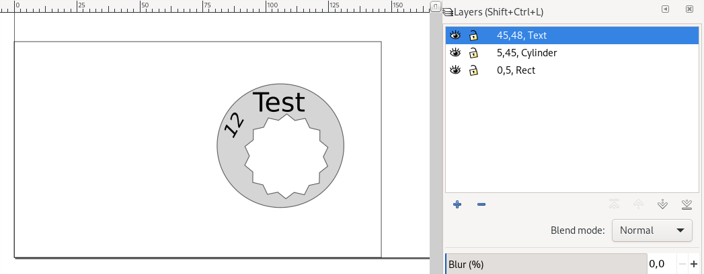
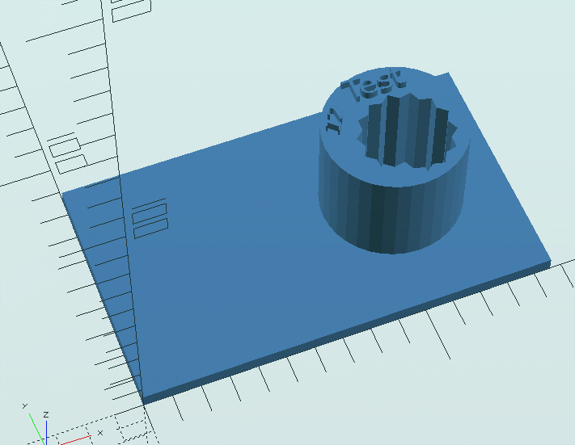

# inkextrude

inkextrude is a simple `XSLT` script which generates an OpenSCAD script containing extrusions of each layer of an input Inkscape `SVG`. The title of the layers is used to define the range of the extrusion. This allows inkscape users to create (very) simple OpenSCAD 3D models without having to write OpenSCAD code.

## Requirements

  * SAXON 9 (or newer) HE `XSLT` processor. Any other `XSLT` 2.0 processor might work but this has not been verified.

  * OpenSCAD 2019.05 (or newer).

## Usage

### Inkscape

The layer name defined in inkscape is passed to the generated openscad function to change parameters. Therefore it has to be a valid openscad function argument definition.

Example:
  
    z=45, height=3 /*Text*/

In this example the extrusion is extruded by 45 millimetres and the extrusion is 3 millimetres high.
In line comments are supported.

Available parameters:

  * `x`: passed to `translate` as x coordinate, default value is `0`
  * `y`: passed to `translate` as y coordinate, default value is `0`
  * `z`: passed to `translate` as z coordinate, default value is `0`
  * `rot_x`: passed to `rotate` as rotation angle, default value is `0`
  * `rot_y`: passed to `rotate` as rotation angle, default value is `0`
  * `rot_z`: passed to `rotate` as rotation angle, default value is `0`
  * `height`: passed to `linear_extrude` as height, default value is `0`
  * `center`: passed to `import`, default value is `false`
  * `linex_scale`: passed to `linear_extrude` as scale, default value is `1`

#### Difference

to subtract an object from the other objects the text `/*diff*/` has to be added to the layer name.

### Transformation

Execute following command within the `demo` directory:

    saxon-xslt demo.svg ../src/inkextrude.xslt > demo.scad

If the `saxon-xslt` wrapper is not available on your system try following command:

    java -jar <path-to-saxon>/saxon-he-10.2.jar -s:demo.svg -xsl:../src/inkextrude.xslt > demo.scad

## Trouble Shooting

* OpenSCAD can only extrude `SVG` objects which are paths. Embedded images or text has to be converted to paths.

### Known and unknown issues

* Please don't use exotic input names, no blanks, no dashes, no fancy characters.
* Execute the `XSLT` script creates a directory with the name `svg_gen`
  in the executing directory. The generated `SCAD` file has to be in the same parent directory as the `svg_gen` directory, otherwise OpenSCAD will not be able to import the `SVG` files.
