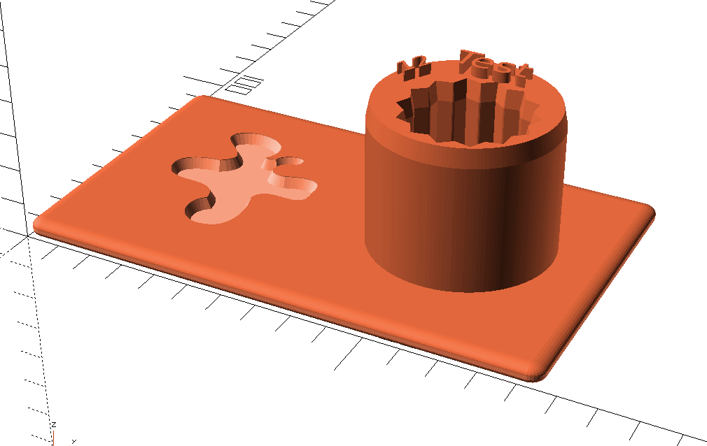

# **inkextrude**

[**inkextrude**](https://github.com/jbenf/inkextrude) is a simple `XSLT` script which generates an OpenSCAD script from an input Inkscape `SVG`. The titles of `layers` and `groups` are translated to OpenSCAD commands while `paths`, `ellipses` and `rects` are extracted to separate `SVG`s and imported in the generated OpenSCAD script.

## Why?

I like OpenSCAD, but I like Inkscape even more. The 3D OpenSCAD workflow never felt natural to me. Coming from Fusion360 I wanted to draw in 2D and extrude the Paths to generate my 3D models without having to work in multiple documents. The original idea of **inkextrude** was to abstract the complexity of OpenSCAD away and offer a very limited set of arguments for the path extrusion. But since my requirements exceeded the capabilities of **inkextrude** in every other design I created I decided to change the approach completely. In version 2 **inkextrude** translates the tree structure of the `SVG` to a more complex OpenSCAD script. This offers almost the functionality of OpenSCAD which of course means that the user needs to know OpenSCAD to use **inkextrude**. Keep your [cheatsheet](http://openscad.org/cheatsheet/) close.

## Requirements

  * An `XSLT 2.0` processor like [SAXON 9 (or newer) HE / B](https://sourceforge.net/projects/saxon/files/Saxon-HE/10/Java/) or
    [xslt3 (npm)](https://www.npmjs.com/package/xslt3)

  * OpenSCAD 2019.05 (or newer).

  * Inkscape 1.2 (or newer) (because of the new *Layers and Objects* view)

## Usage

### Inkscape

The magic happens mostly in the *Layers and Objects* view. _Layers_ and _Groups_ with a title starting with a paragraph character (`§`) will be translated to OpenSCAD commands. If the _Group_ has children these children will be added in curly brackets, otherwise the command will be terminated with a colon (`;`).

Special functions:

* chamfer_extrude: extrude and add a chamfer or fillet
  
  Arguments:
    * `height`: extrusion height, default value is `100`
    * `delta` : chamfer delta, default value is `10`
    * `z`: height of the chamfer edge, default value is `delta`
    * `top`: add chamfer to the top, default is `true`
    * `bottom`: add chamfer to the bottom, default is `false`
    * `type`: set the contour of the chamfer, default is `0`
      - `0`: Chamfer
      - `1`: Convex Fillet
      - `2`: Concave Fillet
      - `3`: Simple Fillet, only works with convex paths. You can create a chamfer by adding $fn=1 (default is 10)

Example:

This will create following OpenSCAD code (excerpt):

        $fn=$preview ? 5 : 30;
        echo(fn = $fn);
        translate([0,0,45]) linear_extrude(height=3) {  
          obj_path892();
          obj_path890();
          obj_path888();
          obj_path886();
          obj_path905();
          obj_path903();
        }
        translate([0,0,5]) chamfer_extrude(height=40, delta=1, z=5) {  
          obj_path854();
        }
        difference() {  
          chamfer_extrude(height=5, delta=4, z=2, type=1, bottom=true) {  
            obj_rect10();
          }
          translate([0,0,2]) {  
            chamfer_extrude(height=4, delta=1.5, z=2.8, bottom=true, top=false) {  
              obj_path1047();
            }
          }
        }

Result:

### __Transformation__

My recommendation is to use the __NPM__ Package _xslt3_ - a wrapper for `SaxonJS`.

Installation:

    npm install -g xslt3

Execute following command within the `examples` directory:

    xslt3 -xsl:../src/inkextrude.xslt -s:demo.svg > demo.scad

### __inkextrude Wrapper__

Alternatively you can use the included `inkextrude` wrapper. The result will be created in the same directory as the input file with the file extension `scad`.

Transform examples/demo.svg using `xslt3`:

    ./inkextrude examples/demo.svg

Transform examples/demo.svg using `docker`:

    ./inkextrude -d examples/demo.svg

Watch the input file for changes and transform the input automatically:

    ./inkextrude -w examples/demo.svg

## Examples

 *  [PSX Controller Port Case](https://www.printables.com/model/390353-psx-snac-adapter-case-for-mms)

    
 *  [Menu Card Holder](https://www.printables.com/model/393308-menu-card-holder)

    

## Tips and Tricks

* Adding empty Groups is not possible in Inkscape. Adding or copying a path and creating a new Group with `ctrl+g` is a quick way to add a group. Just delete the path afterwards.
* Add the paths first and create the needed tree structure with `ctrl+g` later.
* You can add custom modules by adding extrusions to a Group named `§module <MODULE_NAME>()`. You even could add variables to this module and use them for the extrusion or other OpenSCAD commands. This is also very handy if you want to import the generated OpenSCAD script in a custom OpenSCAD script.
* Execute the `XSLT` script creates a directory with the name `svg_gen`
  in the executing directory. The generated `SCAD` file has to be in the same parent directory as the `svg_gen` directory, otherwise OpenSCAD will not be able to import the `SVG` files.

