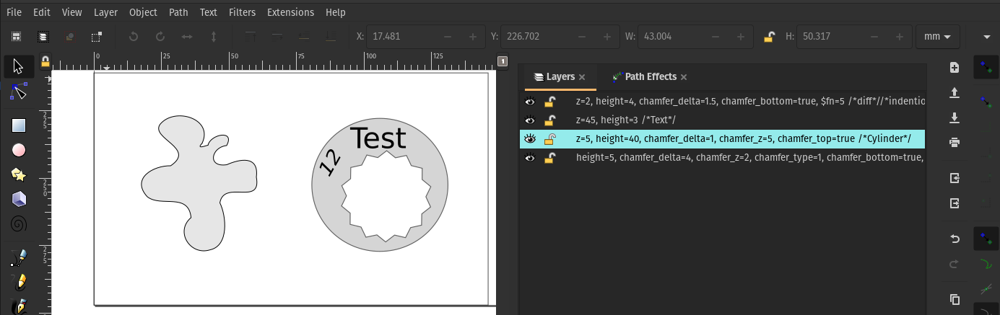
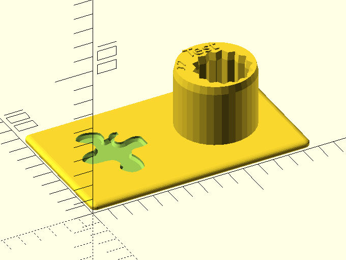

# inkextrude

[inkextrude](https://github.com/jbenf/inkextrude) is a simple `XSLT` script which generates an OpenSCAD script containing extrusions of each layer of an input Inkscape `SVG`. The title of the layers is used to define the range of the extrusion. This allows inkscape users to create (very) simple OpenSCAD 3D models without having to write OpenSCAD code.

## Requirements

  * SAXON 9 (or newer) HE / B `XSLT` processor. Any other `XSLT` 2.0 processor might work but this has not been verified.

  * OpenSCAD 2019.05 (or newer).

## Usage

### Inkscape

The layer name defined in inkscape is passed to the generated openscad function to change parameters. Therefore it has to be a valid openscad function argument definition.

Example:
  
    z=45, height=3 /*Text*/

In this example the extrusion is extruded by 45 millimetres and the extrusion is 3 millimetres high.
In line comments are supported.

Available parameters:

  * `x`: passed to `translate` as x coordinate, default value is `0`
  * `y`: passed to `translate` as y coordinate, default value is `0`
  * `z`: passed to `translate` as z coordinate, default value is `0`
  * `rot_x`: passed to `rotate` as rotation angle, default value is `0`
  * `rot_y`: passed to `rotate` as rotation angle, default value is `0`
  * `rot_z`: passed to `rotate` as rotation angle, default value is `0`
  * `height`: passed to `linear_extrude` as height, default value is `0`
  * `center`: passed to `import`, default value is `false`
  * `linex_scale`: passed to `linear_extrude` as scale, default value is `1`. Don't mix with `chamfer_delta`
  * `chamfer_delta` : used to create a chamfer, default value is `2` (mm). Don't mix with `linex_scale`
  * `chamfer_z`: height of the chamfer edgem default value is `chamfer_delta`
  * `chamfer_top`: add chamfer to the top, default is `false`
  * `chamfer_bottom`: add chamfer to the bottom, default is `false`
  * `chamfer_type`: set the contour of the chamfer, default is `0`
      - `0`: Chamfer
      - `1`: Convex Fillet
      - `2`: Concave Fillet
      - `3`: Simple Fillet, only works with convex paths. You can create a chamfer by adding $fn=1 (default is 10)
  * `diff`: if set to true the object will be substracted from the rest of the design, default is `false`
  * `intersect`: if set to true (in any layer name) the layers will be combined with `intersection`, default is `false`

### __Transformation__

My recommendation is to use the __NPM__ Package _xslt3_ - a wrapper for `SaxonJS`.

Installation:

    npm install -g xslt3

Execute following command within the `demo` directory:

    xslt3 -xsl:../src/inkextrude.xslt -s:demo.svg > demo.scad

### __inkextrude Wrapper__

Alternatively you can use the included `inkextrude` wrapper. The result will be created in the same directory as the input file with the file extension `scad`.

Transform demo/demo.svg using `xslt3`:

    ./inkextrude demo/demo.svg

Transform demo/demo.svg using `docker`:

    ./inkextrude -d demo/demo.svg

Watch the input file for changes and transform the input automatically:

    ./inkextrude -w demo/demo.svg

## Trouble Shooting

* OpenSCAD can only extrude `SVG` objects which are paths. Embedded images or text has to be converted to paths.

### Known and unknown issues

* Please don't use exotic input names, no blanks, no dashes, no fancy characters.
* Execute the `XSLT` script creates a directory with the name `svg_gen`
  in the executing directory. The generated `SCAD` file has to be in the same parent directory as the `svg_gen` directory, otherwise OpenSCAD will not be able to import the `SVG` files.
